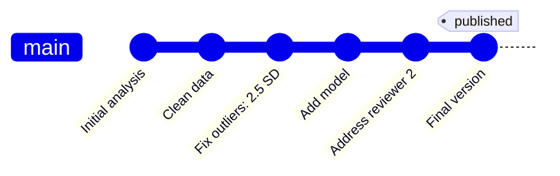

# Git + GitLab + VS Code

- **Git** – Version control on your computer  
- **GitLab** – Collaboration hub (like Google Docs for code)  
- **VS Code** – Editor, terminal, and Git view in one

<!-- notes:
Keep it simple, not technical.
Reassure them: all three tools work together.
GitLab ≈ GitHub but institution-hosted.
-->

---

# Visual: Clean Git History

<!-- notes:
Show this as the *goal*: a clear, readable story of the project.
-->

---

# Why GitLab?

- Provided by the university (private repos)
- Same skills transfer to GitHub
- Great for secure team collaboration
- Merge requests = pull requests
- Groups = organizations

<!-- notes:
Quickly compare GitHub vs GitLab terminology.
Focus on: same skills, safe for team or company data.
-->

---

# Why VS Code?

- One tool to edit, run, and manage version control
- Integrated terminal (no window switching)
- Works with R, Python, SAS, etc.
- Visual Git panel if you need it

<!-- notes:
Goal: lower the barrier.
Show them how it centralizes everything.
-->